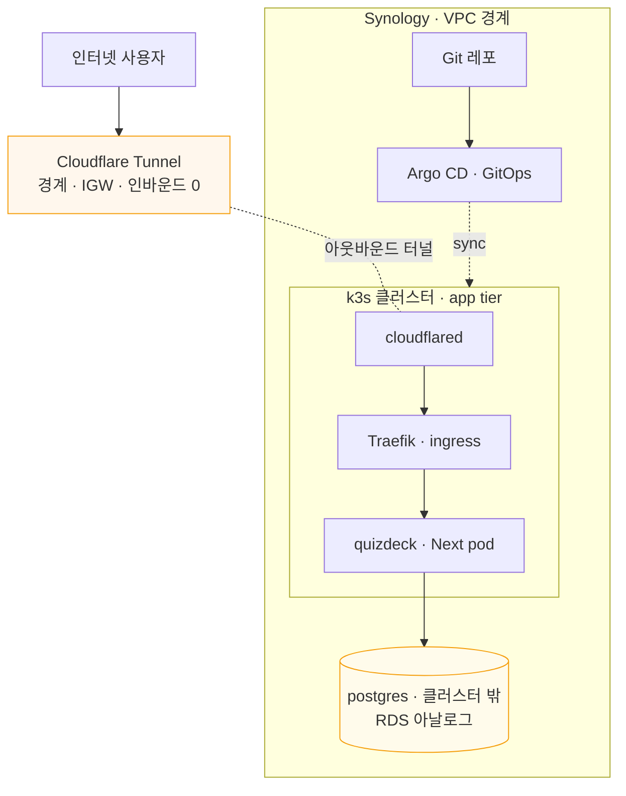

# 플랫폼 로드맵 — Synology as VPC

> 살아있는 설계 문서. 결정 근거는 [ADR-0002](../adr/0002-synology-vpc-platform.md), 데이터 영속 seam은 [ADR-0001](../adr/0001-progressstore-seam.md).
> 아이콘 시각 다이어그램: [platform-diagram.html](./platform-diagram.html) (브라우저로 열기).

개인 Synology를 **장기 private cloud(VPC)** 로 키운다. quizdeck는 첫 워크로드. 학습 + 실용을 GitOps로 잇고, 플랫폼은 **워크로드 위에서 진화**시킨다.

## 불변식

- 외부로 통하는 경로는 **인터넷 → Cloudflare → 터널 → Traefik → Next** 한 줄뿐.
- **postgres는 어디서도 인터넷에 직접 노출되지 않는다.**
- 모든 변경은 **선언적·버전관리(GitOps)** — "배우기 = 하기".
- 각 상위 층은 독립적으로 가치 있고, **가치 < 비용 지점에서 멈춘다.**

## 토폴로지

## 진화 로드맵

| 층 | 구성 | 목적 | 상태 |
|---|---|---|---|
| **L1** | k3s (+ 기본 Traefik) | 클라우드네이티브 substrate | 기반 |
| **L2** | Cloudflare Tunnel | 경계/IGW · 인바운드 0 · 홈 IP 은닉 | 지금 |
| **L3** | quizdeck(Next) + 외부 postgres + Argo CD | 첫 워크로드, GitOps ← **강제 함수** | 지금 |
| **L4** | Prometheus + Grafana + Loki | 관측성 (mesh보다 먼저) | 다음 |
| **L5** | Linkerd | service mesh · mTLS·골든메트릭 | 나중 |
| **L6** | Meshery | 관리 플레인 · Designs/Kanvas로 설계·운영·벤치마킹 | 나중 |

## Synology ↔ AWS 매핑 (이식성)

| 역할 | Synology (지금) | AWS (장래) |
|---|---|---|
| 인터넷 게이트웨이 | Cloudflare Tunnel | CloudFront / public ALB |
| ingress | Traefik (k3s 기본) | ALB / ingress controller |
| 오케스트레이션 | k3s | EKS |
| app tier | Next pod | Fargate / EKS pod |
| data tier | 외부 postgres 컨테이너+볼륨 | RDS (private subnet) |
| 격리 | namespace | VPC / account 분리 |
| 네트워크 정책 | NetworkPolicy | security group |
| 배포 | Argo CD (GitOps) | Argo CD on EKS / CodePipeline |

tier 구조가 동일하므로 바뀌는 건 각 칸의 구현뿐. Synology 셋업이 AWS VPC의 **리허설**이 된다.

## 환경 현황 — Synology `zero` (점검 2026-06-23)

| 항목 | 값 |
|---|---|
| 모델/OS | DSM **7.3.2** · x86_64 · 커널 **4.4.302**(구버전) |
| CPU/RAM | 4 스레드(가상화 vmx/svm 지원) · **9.6GB**(여유 ~8GB) |
| Docker | Container Manager 24.0.2 · 데몬 active |
| VMM | **미설치** (`/dev/kvm` 없음 — 설치 시 활성 가능) |
| Tailscale | **설치됨**(1.58.2) — 단 **로그아웃**(NeedsLogin) |
| 디스크 | /volume1 3.5T · 1.4T 여유 |
| 접속(현재) | `ssh zdmin@young1ll.synology.me`(포트 22, DDNS=49.161.146.228) → `sudo -i`. tmux 세션 `syno` |

**커널 4.4 함의:** k3s를 DSM 맨몸엔 부적합. 두 경로 — **k3d**(현재 Docker로 즉시 가능, 단 4.4 커널 위에서 검증 필요) vs **k3s-in-VMM**(VMM 설치+Linux VM 필요, 가장 견고). VMM 미설치라 k3d가 즉답.

## 직접 작업(협업) 진행

- [x] **기존 docker 컨테이너 정리** — 컨테이너 10·이미지 다수 전부 제거, **36.39GB 회수**. `/volume1/docker`는 `@eaDir`만 남김. (2026-06-23)
- [ ] **원격 접속을 Tailscale로 이전** — Synology에 Tailscale `tailscale up` 로그인(브라우저 인증) + Mac에도 설치/로그인 → 타넷 100.x로 SSH → **포트 22 인터넷 노출 닫기**.
- [ ] **k3s 설치 방식 확정** — k3d(즉시) vs k3s-in-VMM(VMM 설치). 4.4 커널에서 k3d 동작 검증 후 결정.
- [ ] **postgres 외부 구성** — 컨테이너 + 영속 볼륨, 클러스터에서 접근만.
- [ ] **quizdeck 컨테이너화** — `output:'export'` 폐기 → Dockerfile + k8s 매니페스트 + Argo CD 앱.
- [ ] **Cloudflare Tunnel 구성** — `cloudflared` + 호스트네임 → Traefik 라우팅.
- [ ] L4~L6은 L3가 실제로 돌고 난 뒤 착수.

작업 재개 시: tmux `syno` 세션(또는 `ssh zdmin@young1ll.synology.me` → `sudo -i`)에서 이어감.
