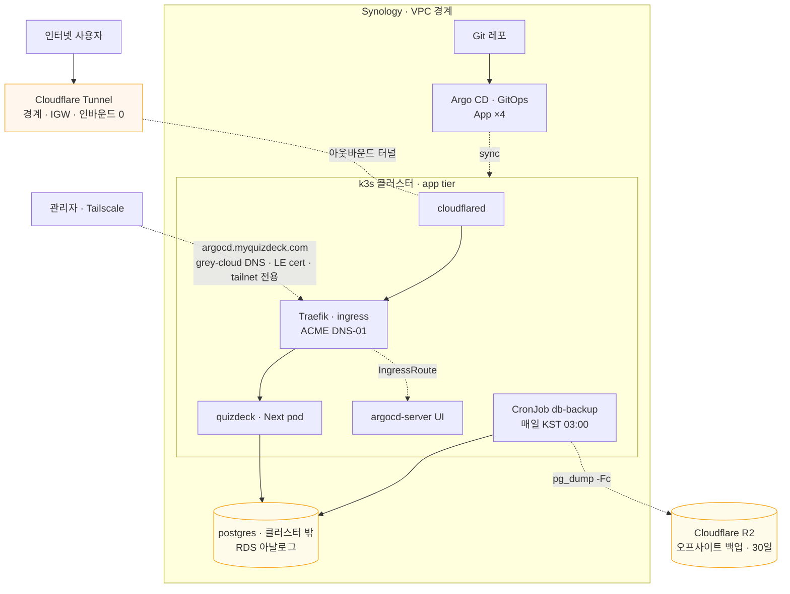

# 플랫폼 로드맵 — Synology as VPC

> 살아있는 설계 문서. 결정 근거는 [ADR-0002](../adr/0002-synology-vpc-platform.md), 데이터 영속 seam은 [ADR-0001](../adr/0001-progressstore-seam.md).
> 다이어그램: **[architecture-aws-style.html](./architecture-aws-style.html)** (AWS 공식 스타일 — VPC/서브넷 경계·AWS 아날로그 매핑) · [platform-diagram.html](./platform-diagram.html) (초기 아이콘 버전) · 현황 [../status.html](../status.html).

개인 Synology를 **장기 private cloud(VPC)** 로 키운다. quizdeck는 첫 워크로드. 학습 + 실용을 GitOps로 잇고, 플랫폼은 **워크로드 위에서 진화**시킨다.

## 불변식

- 외부로 통하는 경로는 **인터넷 → Cloudflare → 터널 → Traefik → Next** 한 줄뿐.
- **postgres는 어디서도 인터넷에 직접 노출되지 않는다.**
- 모든 변경은 **선언적·버전관리(GitOps)** — "배우기 = 하기".
- 각 상위 층은 독립적으로 가치 있고, **가치 < 비용 지점에서 멈춘다.**

## 토폴로지

## 진화 로드맵

| 층 | 구성 | 목적 | 상태 |
|---|---|---|---|
| **L1** | k3s (+ 기본 Traefik) | 클라우드네이티브 substrate | ✅ 가동(k3s-home VM) |
| **L3** | quizdeck(Next) + Argo CD | 첫 워크로드, GitOps ← **강제 함수** | ✅ 배포(Synced/Healthy). postgres는 보류 |
| **L2** | Cloudflare Tunnel | 경계/IGW · 인바운드 0 · 홈 IP 은닉 | ✅ 가동(https://myquizdeck.com) |
| **L4** | Prometheus + Grafana + Loki | 관측성 (mesh보다 먼저) | 다음 |
| **L5** | Linkerd | service mesh · mTLS·골든메트릭 | 나중 |
| **L6** | Meshery | 관리 플레인 · Designs/Kanvas로 설계·운영·벤치마킹 | 나중 |

## Synology ↔ AWS 매핑 (이식성)

| 역할 | Synology (지금) | AWS (장래) |
|---|---|---|
| 인터넷 게이트웨이 | Cloudflare Tunnel | CloudFront / public ALB |
| ingress | Traefik (k3s 기본) | ALB / ingress controller |
| 오케스트레이션 | k3s | EKS |
| app tier | Next pod | Fargate / EKS pod |
| data tier | 외부 postgres 컨테이너+볼륨 | RDS (private subnet) |
| 격리 | namespace | VPC / account 분리 |
| 네트워크 정책 | NetworkPolicy | security group |
| 배포 | Argo CD (GitOps) | Argo CD on EKS / CodePipeline |

tier 구조가 동일하므로 바뀌는 건 각 칸의 구현뿐. Synology 셋업이 AWS VPC의 **리허설**이 된다.

**언제 옮기나 — 날짜가 아니라 트리거 게이트(러ung).** [ADR-0021](../adr/0021-aws-migration-triggers-and-offsite-backup.md): durability 는 오프사이트 R2 백업으로 **먼저**(AWS 무관), 이전은 관측 가능한 트리거가 켜질 때만 러ung 순으로 — **1** 관리형 DB(data tier 먼저; 운영 toil·PITR·RTO 트리거) → **2** origin 이중화(홈박스 다운·pager 불가 → 값싼 VPS, EKS 아님) → **3** 풀 EKS/RDS(scale·SLA). 반대 추: 자기호스팅의 학습 가치. 백업 논리 덤프가 이 이전의 **리허설을 겸한다**(seam 증명).

## 환경 현황 — Synology `zero` (점검 2026-06-23)

| 항목 | 값 |
|---|---|
| 모델/OS | DSM **7.3.2** · x86_64 · 커널 **4.4.302**(구버전) |
| CPU/RAM | 4 스레드(가상화 vmx/svm 지원) · **9.6GB**(여유 ~8GB) |
| Docker | Container Manager 24.0.2 · 데몬 active |
| VMM | **미설치** (`/dev/kvm` 없음 — 설치 시 활성 가능) |
| Tailscale | **설치됨**(1.58.2) — 단 **로그아웃**(NeedsLogin) |
| 디스크 | /volume1 3.5T · 1.4T 여유 |
| Tailscale | **연결됨**(young1ll@github) — `zero`=**100.78.231.75**, `young-macbookpro`=100.64.213.97 |
| 접속(타넷·권장) | `ssh -p 8999 zdmin@100.78.231.75` (키 기반 검증됨) → `sudo` |
| 접속(인터넷·폐쇄 예정) | `ssh zdmin@young1ll.synology.me`(WAN 22→내부 8999, DDNS=49.161.146.228). ⚠️ 봇 프로빙 관측 |

**커널 4.4 함의 — k3s substrate 결정: `k3s-in-VMM` (k3d 탈락, 검증 완료 2026-06-23):**
- k3d로 클러스터 생성 시 k3s containerd가 **overlay-on-overlay 마운트 실패**(`failed to mount overlay ... no such device`) — 커널 4.4는 overlay-on-overlay 미지원(5.x부터).
- 워크어라운드 `--snapshotter=native`로 overlay 회피 → apiserver는 실제로 기동(직접 검증). 그러나 native의 전체-복사가 Synology HDD에서 **너무 느려 10분 타임아웃에도 "k3s is up and running" 미도달** → 실용 substrate 불가.
- 결론: **modern 커널 Linux VM(VMM) 안에서 k3s 실행**. cgroup v2·overlay 정상·빠름. ([[../adr/0002-synology-vpc-platform.md|ADR-0002]]의 미정 항목 해소.) k3d/kubectl 바이너리는 호스트에 남겨둠(향후 VM 클러스터 kubeconfig 접근용 kubectl).

## 직접 작업(협업) 진행

- [x] **기존 docker 컨테이너 정리** — 컨테이너 10·이미지 다수 전부 제거, **36.39GB 회수**. `/volume1/docker`는 `@eaDir`만 남김. (2026-06-23)
- [x] **원격 접속을 Tailscale로 이전** — 양단 연결, 키 기반 타넷 SSH(`100.78.231.75:8999`) 검증. (2026-06-23)
- [ ] **인터넷 SSH 노출 닫기** — 공유기에서 WAN:22→Synology 포워딩 제거(권장), 또는 DSM 방화벽으로 SSH(8999)를 LAN(192.168.0.0/16)+Tailscale(100.64.0.0/10)만 허용. *닫으면 현재 인터넷 경유 tmux 세션은 끊김 → 타넷으로 재접속.* 추가로 SSH 비밀번호 인증 끄고 키 전용 권장.
- [x] **k3s 설치 방식 확정** — k3d 검증 실패(overlay-on-overlay/속도) → **k3s-in-VMM 확정**. (2026-06-23)
- [x] **VMM 설치 + Linux VM 생성** — VMM 설치 후 VM **`k3s-home`**(Ubuntu 24.04.4, 2vCPU·4GB·30GB, OVS Default VM Network) 생성. OS 설치는 **로컬 cidata seed 무인 autoinstall**로(노VNC/시리얼 콘솔이 막혀 GRUB에 `autoinstall`+vfat seed disk(vdb) 주입). 커널 **6.8**·cgroup **v2**·LAN IP **192.168.68.55**. (2026-06-24)
- [x] **VM 안에 k3s 설치** — `curl -sfL https://get.k3s.io | sh -`. **k3s v1.35.5 노드 Ready(17초)**, 시스템 파드 전부 Running, **Traefik ingress = LoadBalancer 192.168.68.55:80/443**. (2026-06-24)
- [x] **VM을 Tailscale 타넷에 올리기** — VM에 Tailscale 1.98.4 설치+`up`. **`k3s-home`=100.81.230.113**. Mac에서 `ssh young1ll@100.81.230.113` 직결 검증. **임시 개인키(`~zdmin/idk`) 제거 완료**, autoinstall http 서버 종료. (2026-06-24)
  - ⚠️ 미해결: VM→Synology호스트 네트워크 차단(OVS host-guest 격리; 호스트→VM은 REACHABLE). 게스트↔게스트(같은 OVS)는 가능 → **별도 DB VM이면 k3s에서 도달 가능**. 외부 postgres 위치 결정 시 고려.
  - LVM root LV가 14G(30G 디스크 중) — 필요 시 `lvextend`로 확장.
- [x] **quizdeck 컨테이너화 + GitOps 배포 (L3 완성, 2026-06-24)** — 정적 export 유지(폐기 아님) + nginx 서빙. `Dockerfile`(멀티스테이지 node22→pnpm build→nginx:alpine) + `k8s/base` kustomize(ns `quizdeck`, Traefik ingress catch-all) + `.github/workflows/deploy.yml`(main push→pnpm test→ghcr 빌드/push→kustomize newTag sha bump 커밋, GITHUB_TOKEN이라 재트리거 없음) + Argo CD.
  - **Argo CD 설치**: `argocd` ns, `install.yaml` **server-side apply**(applicationsets CRD가 client-side 262KB 한도 초과 → server-side로 해결), 파드 7종 Running.
  - **첫 배포 검증**: PR #1 머지 → CI 성공(1m39s, 이미지 `ghcr.io/young1ll/quizdeck:sha-19d465c`) → Argo **Synced/Healthy**, pod 1/1 Running. Mac→타넷→Traefik으로 `/`(200, `<title>QuizDeck`), `/aws/sap-c02/`(200), 정적자산(200), 404 처리까지 확인.
  - CI 함정: `pnpm/action-setup` `version` 입력 + package.json `packageManager` 이중 지정 충돌 → `version` 제거(packageManager 단일 출처).
- [x] **Cloudflare Tunnel 구성 (L2 완성, 2026-06-24)** — 도메인 **`myquizdeck.com`**(Cloudflare Registrar 구매, zone 자동 활성). Zero Trust 대시보드에서 터널 `synology-k3s`(ID `69e8bc69-…`) 생성 → 토큰을 k8s **Secret `cloudflared-token`**(ns `cloudflare`, **git 밖**)으로 저장 → `cloudflared` Deployment(2 replica, `cloudflare/cloudflared:latest`, `tunnel run` + TUNNEL_TOKEN). 서울 엣지(icn01/icn06) QUIC 등록. Public Hostname `myquizdeck.com` → `http://traefik.kube-system.svc.cluster.local:80`(Host 보존 → Traefik catch-all → quizdeck).
  - **검증**: `https://myquizdeck.com` 200(`server: cloudflare`), `/aws/sap-c02/`·자산 200. **인바운드 포트 0**(아웃바운드 터널만), 홈 IP 은닉, HTTPS 엣지 인증서.
  - 함정: 대시보드 서비스 URL 오타(`treafik`→`traefik`)로 초기 502(`no such host`) — 한 글자 수정으로 해결.
  - ✅ 후속 다듬기(2026-06-24): **cloudflared를 git/Argo 편입**(`k8s/cloudflared` + 별도 Argo App `cloudflared`, Synced/Healthy; Secret은 git 밖 유지) + **옛 index.html/.nojekyll 제거 + GitHub Pages 비활성**. 이제 quizdeck·cloudflared **둘 다 GitOps 관리**.
  - 남은 선택: `www`→apex 리다이렉트(Cloudflare 대시보드 Redirect Rule 필요), Ingress host 고정은 **2번째 앱/시험 도입 시**(지금 catch-all이 공개+타넷 내부 모두 커버, 고정하면 IP 접근 깨짐).
- [~] **L3½ — 로그인 + 진도 동기화 (설계 완료, 구현 대기, 2026-06-24)** — 그릴링으로 아키텍처 확정. 상세 [ADR-0003](../adr/0003-auth-and-progress-sync.md) + 브리프 [auth-progress-sync-brief](../design/auth-progress-sync-brief.md).
  - **quizdeck → Next standalone 서버**(정적 export 폐기) + **better-auth(in-app)**(이메일+비번·GitHub·Google·Naver·패스키). 무거운 IdP 대신 — JWKS로 미래 NestJS 검증 경로 열어둠.
  - **데이터 tier = 별도 DB VM의 postgres**(RDS 아날로그, 인터넷 미노출, k3s 게스트↔게스트 LAN). better-auth 테이블 + `progress(learner_id, exam_key, snapshot jsonb, updated_at)`.
  - **동기화 = local-first composite ProgressStore**(localStorage+RemoteApi, LWW) — ADR-0001 seam 활용.
  - 구현은 새 세션에서 `/to-prd`→`/to-issues`→`/implement`. 외부 등록 필요: GitHub/Google/Naver OAuth 앱.
- [~] **#4 DB VM 프로비저닝 키트 (재현 가능 키트 완료, 박스 실행 대기, 2026-06-24)** — data tier를 별도 VM `db-home`으로 띄우는 GitOps 키트를 `infra/db-vm/`에 작성. **autoinstall 시드**(Ubuntu 24.04, k3s-home의 CIDATA 패턴 재사용, postgres·ufw 포함) + **멱등 스크립트** 3종(`provision-postgres.sh`=앱 role/DB·`listen_addresses`·pg_hba를 k3s VM IP `192.168.68.55`로만 한정·scram-sha-256 / `configure-firewall.sh`=ufw default-deny+5432는 k3s VM에서만 / `verify-isolation.sh`=AC를 `--expect open|closed` pass/fail 프로브로) + **k8s Secret README**(`db-credentials`, 값은 git 밖) + 디스크 여유(`lvextend`)·백업(pg_dump/VM 스냅샷/오프박스) 메모. shellcheck clean·시드 YAML 검증 완료. **박스 실행(VMM에서 VM 생성→provision→firewall→verify)은 DSM UI 손작업이 섞여 미실행** — 실행 후 `verify-isolation.sh` PASS를 여기 기록한다. (스키마/테이블은 V1·V2.)
- [x] **오프사이트 DB 백업 → Cloudflare R2 (라이브·검증, 2026-07-09)** — data tier 백업 3계층(pg_dump·VM 스냅샷·/volume1)이 전부 같은 Synology 위라 박스 loss=전손 위험 → 다른 실패 도메인(R2)으로 매일 논리 덤프. 인앱 대시보드가 아니라 durability 를 AWS 무관하게 먼저 막는 결정 ([ADR-0021](../adr/0021-aws-migration-triggers-and-offsite-backup.md), 아키텍처 리뷰 인프라·가시성 후보 ①). `k8s/backup/` CronJob(`pg_dump -Fc "$DATABASE_URL"` → `mc pipe` → R2, 매일 KST 03:00·30일 lifecycle) + 새 Argo App `backup`(quizdeck ns, `db-credentials` 재사용) + 명령형 bootstrap(R2 버킷·lifecycle·`r2-backup` Secret). 이 덤프는 durability + **관리형 postgres 이전 리허설/seam 증명**을 겸함. **박스 실행(R2 버킷·API 토큰·Secret·Argo apply·1회 실행)은 미실행** — 실행 후 R2 에 객체 생성 + **복원 리허설 RTO** 를 여기 기록한다(러ung 1 "RTO 불용" 트리거의 측정 기준). **실행(2026-07-09)**: R2 버킷 `quizdeck-backups`(30일 lifecycle) + `r2-backup` Secret → Argo App `backup` Synced/Healthy → 수동 잡으로 **648805 bytes 덤프 R2 업로드 + backup ok** 검증. 첫 파드 OOMKilled(256Mi 빠듯) 발견 → `set -euo pipefail`(0바이트 백업 방지) + 512Mi 강화(sha d572132), 재검증 시 단일 파드·OOM 없음. **남은 것**: 복원 리허설 RTO 측정(옵션).
- [x] **ArgoCD UI Tailscale 전용 노출 (라이브·검증, 2026-07-09)** — 배포 조망(CD)의 정본인 ArgoCD UI 를 tailnet 에서만 도달 가능하게. 인앱 대시보드를 짓지 않고 정본 도구(Actions=CI, Argo=CD)를 admin 허브에서 링크 ([ADR-0020](../adr/0020-argocd-tailnet-visibility.md), 아키텍처 리뷰 인프라·가시성 후보 ②). `argocd.myquizdeck.com` → **Cloudflare grey-cloud(DNS-only)** → VM Tailscale IP(`k3s-home`=100.81.230.113) → Traefik **IngressRoute**(DNS-01 진짜 LE 인증서) → argocd-server(`--insecure`). **인바운드 0 유지**(grey 라 공개 A 레코드가 라우팅 불가한 100.x → 인터넷 도달 불가; orange 로 뒤집으면 열림 → 프로브가 방어). GitOps 키트 `k8s/argocd-server/`(IngressRoute + 새 Argo App `argocd-server-expose`) + 명령형 bootstrap 런북(`--insecure` 패치·Traefik certresolver·grey-cloud DNS·DNS-01 토큰 Secret) + `verify-argo-exposure.sh`(grey-cloud=internet-closed / tailnet-open+유효인증서 / 무회귀 pass/fail — `verify-isolation.sh` 형식). shellcheck clean. **박스 실행(CF 레코드·Traefik HelmChartConfig·insecure·Argo App apply·프로브)은 tailnet 손작업이라 미실행** — 실행 후 `verify-argo-exposure.sh` ALL PASS 를 여기 기록한다. 재사용 패턴: 미래 내부 서비스(`grafana.`·`meshery.`, L4~L6)에 grey-cloud→Tailscale-IP + Traefik DNS-01 을 그대로 재적용. **실행(2026-07-09)**: `cloudflare-dns-token` Secret → Traefik **HelmChartConfig**(ACME DNS-01, 기존 env 4개 보존, 라이브 사이트 200 무손상) → argocd-server `--insecure` → IngressRoute apply → **진짜 LE 인증서 발급**(만료 2026-10-07). 격리 3단언 검증(grey-cloud=dig가 CGNAT `100.x` 반환 / tailnet http200+sslverify0 / myquizdeck.com 무회귀). **함정(교훈)**: grey-cloud A레코드 IP 오타(`100.`**`9`**`1` → `100.`**`8`**`1.230.113`)로 초기 curl 타임아웃 — `dig @1.1.1.1` 권위조회로 특정·수정. 인프라는 멀쩡, DNS 한 자 오타가 원인이었다.
- [ ] L4~L6(관측성→mesh→Meshery)은 L3½ 이후 착수.

작업 재개 시: tmux `syno` 세션(또는 `ssh zdmin@young1ll.synology.me` → `sudo -i`)에서 이어감.
