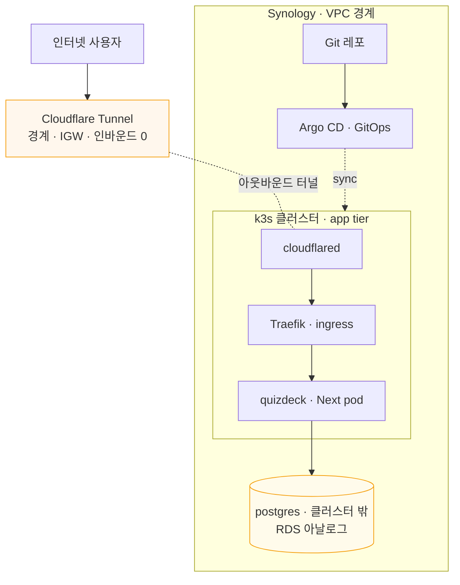

# 플랫폼 로드맵 — Synology as VPC

> 살아있는 설계 문서. 결정 근거는 [ADR-0002](../adr/0002-synology-vpc-platform.md), 데이터 영속 seam은 [ADR-0001](../adr/0001-progressstore-seam.md).
> 아이콘 시각 다이어그램: [platform-diagram.html](./platform-diagram.html) (브라우저로 열기).

개인 Synology를 **장기 private cloud(VPC)** 로 키운다. quizdeck는 첫 워크로드. 학습 + 실용을 GitOps로 잇고, 플랫폼은 **워크로드 위에서 진화**시킨다.

## 불변식

- 외부로 통하는 경로는 **인터넷 → Cloudflare → 터널 → Traefik → Next** 한 줄뿐.
- **postgres는 어디서도 인터넷에 직접 노출되지 않는다.**
- 모든 변경은 **선언적·버전관리(GitOps)** — "배우기 = 하기".
- 각 상위 층은 독립적으로 가치 있고, **가치 < 비용 지점에서 멈춘다.**

## 토폴로지

## 진화 로드맵

| 층 | 구성 | 목적 | 상태 |
|---|---|---|---|
| **L1** | k3s (+ 기본 Traefik) | 클라우드네이티브 substrate | 기반 |
| **L2** | Cloudflare Tunnel | 경계/IGW · 인바운드 0 · 홈 IP 은닉 | 지금 |
| **L3** | quizdeck(Next) + 외부 postgres + Argo CD | 첫 워크로드, GitOps ← **강제 함수** | 지금 |
| **L4** | Prometheus + Grafana + Loki | 관측성 (mesh보다 먼저) | 다음 |
| **L5** | Linkerd | service mesh · mTLS·골든메트릭 | 나중 |
| **L6** | Meshery | 관리 플레인 · Designs/Kanvas로 설계·운영·벤치마킹 | 나중 |

## Synology ↔ AWS 매핑 (이식성)

| 역할 | Synology (지금) | AWS (장래) |
|---|---|---|
| 인터넷 게이트웨이 | Cloudflare Tunnel | CloudFront / public ALB |
| ingress | Traefik (k3s 기본) | ALB / ingress controller |
| 오케스트레이션 | k3s | EKS |
| app tier | Next pod | Fargate / EKS pod |
| data tier | 외부 postgres 컨테이너+볼륨 | RDS (private subnet) |
| 격리 | namespace | VPC / account 분리 |
| 네트워크 정책 | NetworkPolicy | security group |
| 배포 | Argo CD (GitOps) | Argo CD on EKS / CodePipeline |

tier 구조가 동일하므로 바뀌는 건 각 칸의 구현뿐. Synology 셋업이 AWS VPC의 **리허설**이 된다.

## 미해결 / 직접 작업(협업) 항목

사용자와 함께 Synology에 직접 접속해 진행할 것:

- [ ] **k3s 설치 방식 확정** — DSM 맨몸은 커널/cgroup 마찰 → **k3s-in-VMM(가상머신) vs k3d**(k3s-in-docker) 결정.
- [ ] **기존 docker 컨테이너 정리**(삭제 OK) — 현황 파악 후 공간 확보.
- [ ] **postgres 외부 구성** — 컨테이너 + 영속 볼륨(데이터 내구성), 클러스터에서 접근만.
- [ ] **quizdeck 컨테이너화** — `output:'export'` 폐기 → Dockerfile + k8s 매니페스트(Deployment/Service/Ingress) + Argo CD 앱.
- [ ] **Cloudflare Tunnel 구성** — `cloudflared` + 호스트네임 → Traefik 라우팅.
- [ ] L4~L6은 L3가 실제로 돌고 난 뒤 착수.

작업 시작 시 필요: 접속 수단(`! ssh user@synology`), DSM/Container Manager 버전, 기존 컨테이너 목록.
